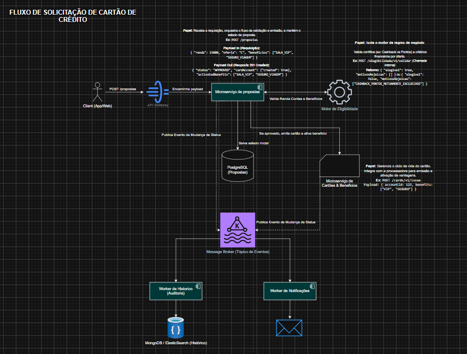
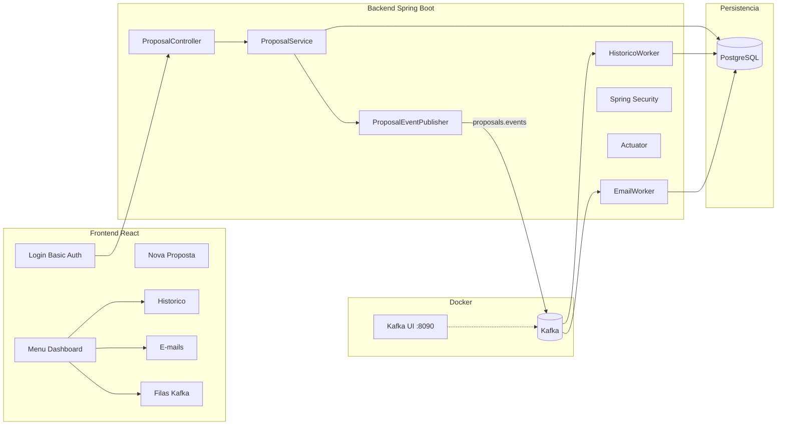

# API Solicita Cartões BTG — Proposals API

POC de propostas de cartão de crédito com motor de elegibilidade **Strategy (GoF)**, **PostgreSQL + Flyway**, **Kafka**, workers assíncronos, **Spring Security**, **Actuator** e dashboard **React**.

Repositório: [api-solicita-cartoes-btg-valorei](https://github.com/marcelohs402015/api-solicita-cartoes-btg-valorei)

## Stack

| Camada | Tecnologia |
|--------|------------|
| Backend | Java 21, Spring Boot 3.3, Maven, Lombok |
| Persistência | PostgreSQL 16, Flyway, Spring Data JPA |
| Mensageria | Apache Kafka 3.7, Spring Kafka |
| Segurança | Spring Security (HTTP Basic) |
| Observabilidade | Spring Boot Actuator |
| Documentação | OpenAPI 3 (Swagger) |
| Frontend | React 18, TypeScript, Tailwind CSS, Vite |
| Infra | Docker, Docker Compose |

## Arquitetura

### Visão alvo (BTG)

Fluxo de solicitação de cartão de crédito — referência do desafio técnico:



### Implementação desta POC



## Regras de Elegibilidade

| Regra | Condição |
|-------|----------|
| Oferta A | Renda > R$ 1.000 |
| Oferta B | Renda > R$ 15.000 **e** Investimentos > R$ 5.000 |
| Oferta C | Renda > R$ 50.000 **e** Tempo de conta > 2 anos |
| Conflito de benefícios | CASHBACK e PONTOS não podem coexistir |
| Seguro Viagem | Apenas Oferta C |
| Sala VIP | Apenas Ofertas B e C |

## Banco de dados (Flyway)

| Tabela | Uso |
|--------|-----|
| `proposta` | Estado da proposta persistido |
| `historico` | Worker de auditoria (histórico) |
| `email_disparo` | Worker de notificações (e-mail mock) |

## Endpoints principais

| Método | Rota | Descrição |
|--------|------|-----------|
| POST | `/api/v1/proposals` | Submeter proposta |
| GET | `/api/v1/proposals` | Listar propostas |
| GET | `/api/v1/proposals/{id}/execution` | Fluxo de execução |
| GET | `/api/v1/historico` | Histórico de auditoria |
| GET | `/api/v1/emails` | E-mails gerados |
| GET | `/api/v1/emails/{id}` | Template do e-mail |
| GET | `/api/v1/queues/status` | Status Kafka e workers |
| GET | `/api/v1/events` | Eventos Kafka consumidos |
| GET | `/actuator/health` | Health check (público) |
| GET | `/actuator/info` | Info da aplicação (autenticado) |

## Segurança

- **HTTP Basic Auth** em todos os endpoints `/api/**`
- Swagger e `/actuator/health` públicos
- Credenciais padrão: `admin` / `admin123`

## Pré-requisitos

| Ferramenta | Versão mínima | Uso |
|------------|---------------|-----|
| Docker Desktop | 4.x | Subir stack completa ou infra |
| Java | 21 | Backend local |
| Maven | 3.9+ | Build e execução do backend |
| Node.js | 20+ | Frontend local |
| npm | 10+ | Dependências do frontend |

## Como executar

### Opção 1 — Stack completa com Docker (recomendado)

Na raiz do projeto:

```bash
docker compose up --build
```

Subir em segundo plano:

```bash
docker compose up --build -d
```

Ver status dos containers:

```bash
docker compose ps
```

Ver logs (todos os serviços):

```bash
docker compose logs -f
```

Ver logs apenas do backend:

```bash
docker compose logs -f backend
```

Parar os containers:

```bash
docker compose stop
```

Parar e remover containers:

```bash
docker compose down
```

Parar, remover containers e volumes (limpa dados do Postgres):

```bash
docker compose down -v
```

### Opção 2 — Desenvolvimento local (backend + frontend na máquina)

**Passo 1 — Subir apenas a infraestrutura (Postgres, Kafka e Kafka UI):**

```bash
docker compose up postgres kafka kafka-ui -d
```

Aguardar os containers ficarem healthy:

```bash
docker compose ps
```

**Passo 2 — Backend (terminal 1):**

```bash
cd backend
mvn spring-boot:run
```

Variáveis usadas automaticamente pelo `application.yml` em dev local:

| Variável | Valor padrão |
|----------|--------------|
| `SPRING_DATASOURCE_URL` | `jdbc:postgresql://localhost:5432/proposals` |
| `SPRING_DATASOURCE_USERNAME` | `proposals` |
| `SPRING_DATASOURCE_PASSWORD` | `proposals` |
| `SPRING_KAFKA_BOOTSTRAP_SERVERS` | `localhost:9092` |
| `APP_SECURITY_USERNAME` | `admin` |
| `APP_SECURITY_PASSWORD` | `admin123` |

**Passo 3 — Frontend (terminal 2):**

```bash
cd frontend
npm install
npm run dev
```

### Build sem subir a aplicação

Backend (executa testes antes do empacotamento):

```bash
cd backend
mvn clean package
```

Frontend:

```bash
cd frontend
npm install
npm run build
```

Preview do build de produção do frontend:

```bash
cd frontend
npm run preview
```

### Testes

Backend (unitários + relatório JaCoCo, mínimo 60%):

```bash
cd backend
mvn clean verify
```

Relatório HTML: `backend/target/site/jacoco/index.html`

Frontend:

```bash
cd frontend
npm install
npm test
npm run test:coverage
```

Relatório HTML: `frontend/coverage/index.html`

## URLs de acesso

| URL | Descrição | Autenticação |
|-----|-----------|--------------|
| http://localhost:5173 | Dashboard React | `admin` / `admin123` |
| http://localhost:8080/swagger-ui.html | Swagger (OpenAPI) | Público (Authorize: `admin` / `admin123` para testar API) |
| http://localhost:8090 | Kafka UI | Público |
| http://localhost:8080/actuator/health | Health check | Público |
| http://localhost:8080/actuator/info | Info da aplicação | `admin` / `admin123` |
| http://localhost:8080/api/v1/proposals | API de propostas | `admin` / `admin123` |

## Testar API via terminal (opcional)

Submeter proposta aprovada:

```bash
curl -u admin:admin123 -X POST http://localhost:8080/api/v1/proposals \
  -H "Content-Type: application/json" \
  -d "{\"renda\":5000,\"investimentos\":1000,\"tempoContaAnos\":1,\"tipoOferta\":\"A\",\"beneficios\":[\"CASHBACK\"]}"
```

Listar histórico:

```bash
curl -u admin:admin123 http://localhost:8080/api/v1/historico?limit=10
```

Listar e-mails gerados:

```bash
curl -u admin:admin123 http://localhost:8080/api/v1/emails?limit=10
```

Status das filas Kafka:

```bash
curl -u admin:admin123 http://localhost:8080/api/v1/queues/status
```

Health check:

```bash
curl http://localhost:8080/actuator/health
```

## Portas utilizadas

| Porta | Serviço |
|-------|---------|
| 5173 | Frontend (Docker) ou Vite dev server (local) |
| 8080 | Backend Spring Boot |
| 5432 | PostgreSQL |
| 9092 | Kafka |
| 8090 | Kafka UI |

## Solução de problemas

**Backend não conecta no Kafka** (`Connection to localhost:9092 could not be established`):

```bash
docker compose up kafka kafka-ui -d
docker compose ps
```

**Backend não conecta no Postgres**:

```bash
docker compose up postgres -d
docker compose ps
```

**Reiniciar apenas o backend no Docker**:

```bash
docker compose up --build backend -d
```

**Porta 8080 ou 5173 já em uso** — pare o processo local ou altere o mapeamento no `docker-compose.yml`.

## Dashboard — menu

| Tela | Conteúdo |
|------|----------|
| Nova Proposta | Formulário, resultado com oferta/valores/benefícios aprovados e fluxo de execução |
| Propostas | Tabela PostgreSQL com renda, investimentos e benefícios ativados |
| Histórico | Worker de auditoria com oferta e benefícios no payload do evento |
| E-mails | Lista e preview com oferta e benefícios aprovados no template |
| Filas / Kafka | Tópico, consumers, eventos processados e link Kafka UI |

## Jornada de testes da POC

Roteiro para validar o desafio técnico ponta a ponta: **regras de negócio (Strategy)** → **persistência** → **Kafka** → **workers** → **dashboard**.

**Pré-requisito:** stack rodando (Docker ou local) e login em http://localhost:5173 (`admin` / `admin123`).

### Passo 0 — Conferir saúde da stack

```bash
curl http://localhost:8080/actuator/health
docker compose ps
```

Esperado: `status: UP` e containers `postgres`, `kafka`, `backend`, `frontend` healthy.

---

### Cenário 1 — Aprovação simples (Oferta A + CASHBACK)

Objetivo: validar fluxo feliz completo.

| Campo | Valor |
|-------|-------|
| Renda | `5000` |
| Investimentos | `1000` |
| Tempo de conta | `1` |
| Oferta | **A** |
| Benefícios | **CASHBACK** |

**Ação:** Nova Proposta → Submeter Proposta.

**Validar em cada tela:**

| Onde | O que conferir |
|------|----------------|
| Nova Proposta | Status `APPROVED`, oferta A, valores em R$, badge **CASHBACK** em "Benefícios aprovados", conta `CARD-...` |
| Execução do fluxo | Steps `PUBLICACAO_KAFKA`, `WORKER_HISTORICO` e `WORKER_EMAIL` evoluindo para `DONE` |
| Propostas | Linha com oferta A, renda R$ 5.000, badge CASHBACK, status verde |
| Histórico | Eventos `PROPOSTA_PERSISTIDA`, `EVENTO_KAFKA_PUBLICADO`, `STATUS_ALTERADO_KAFKA` com oferta e benefícios |
| E-mails | E-mail gerado com oferta A e **CASHBACK** no preview |
| Filas / Kafka | Consumers `ACTIVE`, contador de eventos > 0, eventos no painel inferior |

**Opcional (API):**

```bash
curl -u admin:admin123 -X POST http://localhost:8080/api/v1/proposals \
  -H "Content-Type: application/json" \
  -d "{\"renda\":5000,\"investimentos\":1000,\"tempoContaAnos\":1,\"tipoOferta\":\"A\",\"beneficios\":[\"CASHBACK\"]}"
```

Resposta esperada: `"status":"APPROVED"` e `"activatedBenefits":["CASHBACK"]`.

---

### Cenário 2 — Rejeição financeira (Oferta B com dados padrão)

Objetivo: validar regra de renda e investimentos.

| Campo | Valor |
|-------|-------|
| Renda | `5000` (padrão) |
| Investimentos | `1000` (padrão) |
| Tempo de conta | `1` |
| Oferta | **B** |
| Benefícios | nenhum |

**Validar:** Status `REJECTED`, motivos de renda e investimentos insuficientes, **sem** e-mail gerado, benefícios solicitados vazios.

---

### Cenário 3 — Aprovação Oferta B + Sala VIP

Objetivo: validar regra financeira B e benefício exclusivo B/C.

| Campo | Valor |
|-------|-------|
| Renda | `20000` |
| Investimentos | `10000` |
| Tempo de conta | `1` |
| Oferta | **B** |
| Benefícios | **SALA_VIP** |

**Validar:** `APPROVED`, badge **SALA_VIP** no resultado, histórico, propostas e e-mail.

---

### Cenário 4 — Aprovação Oferta C + Seguro Viagem

Objetivo: validar regra de tempo de conta e benefício exclusivo da Oferta C.

| Campo | Valor |
|-------|-------|
| Renda | `60000` |
| Investimentos | `1000` |
| Tempo de conta | `3` |
| Oferta | **C** |
| Benefícios | **SEGURO_VIAGEM** (+ opcional **SALA_VIP**) |

**Validar:** `APPROVED` com benefícios corretos em todas as telas.

---

### Cenário 5 — Conflito CASHBACK + PONTOS

Objetivo: validar `BenefitConflictEligibilityRule`.

| Campo | Valor |
|-------|-------|
| Renda | `5000` |
| Oferta | **A** |
| Benefícios | **CASHBACK** e **PONTOS** (ambos marcados) |

**Validar:** `REJECTED` com mensagem de conflito, benefícios solicitados visíveis, **nenhum** e-mail.

---

### Cenário 6 — Seguro Viagem na Oferta A (regra de oferta)

Objetivo: validar `BenefitOfferEligibilityRule`.

| Campo | Valor |
|-------|-------|
| Renda | `5000` |
| Oferta | **A** |
| Benefícios | **SEGURO_VIAGEM** |

**Validar:** `REJECTED` — "Beneficio SEGURO_VIAGEM disponivel apenas para Oferta C".

---

### Cenário 7 — Sala VIP na Oferta A

| Campo | Valor |
|-------|-------|
| Renda | `5000` |
| Oferta | **A** |
| Benefícios | **SALA_VIP** |

**Validar:** `REJECTED` — sala VIP apenas em ofertas B e C.

---

### Cenário 8 — Rastreabilidade Kafka (desenho BTG)

Objetivo: conectar a POC ao diagrama de arquitetura.

1. Submeta o **Cenário 1** (aprovada).
2. Abra **Filas / Kafka** → confira tópico `proposals.events` e workers.
3. Abra **Kafka UI** (http://localhost:8090) → tópico `proposals.events` → mensagens.
4. Em **Histórico**, confira a cadeia:
   - `PROPOSTA_PERSISTIDA` (sync)
   - `EVENTO_KAFKA_PUBLICADO` (sync, pós-commit)
   - `STATUS_ALTERADO_KAFKA` (worker assíncrono)
5. Em **E-mails**, confira o template com `tipoOferta` e `beneficios` aprovados.

---

### Checklist final da POC

- [ ] Login e menu do dashboard funcionando
- [ ] Proposta aprovada persiste no Postgres (**Propostas**)
- [ ] Motor Strategy rejeita cenários inválidos com motivos claros
- [ ] Benefícios aprovados visíveis no resultado, histórico, propostas e e-mail
- [ ] Kafka publica evento e workers processam (histórico + e-mail)
- [ ] Fluxo de execução reflete status real (incluindo Kafka)
- [ ] Swagger e Actuator acessíveis
- [ ] Testes automatizados passando (`mvn clean verify` e `npm run test:coverage`)

## Demonstração rápida (5 minutos)

1. Acesse http://localhost:5173 e faça login (`admin` / `admin123`)
2. Execute o **Cenário 1** (Oferta A + CASHBACK)
3. Execute o **Cenário 5** (conflito CASHBACK + PONTOS) para ver rejeição
4. Navegue por **Propostas**, **Histórico**, **E-mails** e **Filas / Kafka**
5. Confira o tópico no Kafka UI (http://localhost:8090)

---

## Autor — [Marcelo Hernandes da Silva](https://www.linkedin.com/in/marcelo-hernandes-da-silva-351a7159/)

Projeto desenvolvido para fins de desafio técnico.
