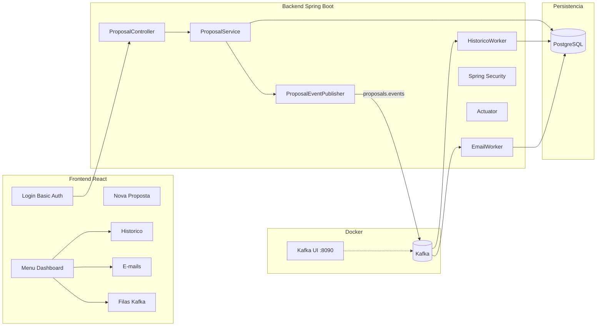

# API Solicita Cartões BTG — Proposals API

POC de propostas de cartão de crédito com motor de elegibilidade **Strategy (GoF)**, **PostgreSQL + Flyway**, **Kafka**, workers assíncronos, **Spring Security**, **Actuator** e dashboard **React**.

Repositório: [api-solicita-cartoes-btg-valorei](https://github.com/marcelohs402015/api-solicita-cartoes-btg-valorei)

## Stack

| Camada | Tecnologia |
|--------|------------|
| Backend | Java 21, Spring Boot 3.3, Maven, Lombok |
| Persistência | PostgreSQL 16, Flyway, Spring Data JPA |
| Mensageria | Apache Kafka 3.7, Spring Kafka |
| Segurança | Spring Security (HTTP Basic) |
| Observabilidade | Spring Boot Actuator |
| Documentação | OpenAPI 3 (Swagger) |
| Frontend | React 18, TypeScript, Tailwind CSS, Vite |
| Infra | Docker, Docker Compose |

## Arquitetura



## Regras de Elegibilidade

| Regra | Condição |
|-------|----------|
| Oferta A | Renda > R$ 1.000 |
| Oferta B | Renda > R$ 15.000 **e** Investimentos > R$ 5.000 |
| Oferta C | Renda > R$ 50.000 **e** Tempo de conta > 2 anos |
| Conflito de benefícios | CASHBACK e PONTOS não podem coexistir |
| Seguro Viagem | Apenas Oferta C |
| Sala VIP | Apenas Ofertas B e C |

## Banco de dados (Flyway)

| Tabela | Uso |
|--------|-----|
| `proposta` | Estado da proposta persistido |
| `historico` | Worker de auditoria (histórico) |
| `email_disparo` | Worker de notificações (e-mail mock) |

## Endpoints principais

| Método | Rota | Descrição |
|--------|------|-----------|
| POST | `/api/v1/proposals` | Submeter proposta |
| GET | `/api/v1/proposals` | Listar propostas |
| GET | `/api/v1/proposals/{id}/execution` | Fluxo de execução |
| GET | `/api/v1/historico` | Histórico de auditoria |
| GET | `/api/v1/emails` | E-mails gerados |
| GET | `/api/v1/emails/{id}` | Template do e-mail |
| GET | `/api/v1/queues/status` | Status Kafka e workers |
| GET | `/api/v1/events` | Eventos Kafka consumidos |
| GET | `/actuator/health` | Health check (público) |
| GET | `/actuator/info` | Info da aplicação (autenticado) |

## Segurança

- **HTTP Basic Auth** em todos os endpoints `/api/**`
- Swagger e `/actuator/health` públicos
- Credenciais padrão: `admin` / `admin123`

## Pré-requisitos

| Ferramenta | Versão mínima | Uso |
|------------|---------------|-----|
| Docker Desktop | 4.x | Subir stack completa ou infra |
| Java | 21 | Backend local |
| Maven | 3.9+ | Build e execução do backend |
| Node.js | 20+ | Frontend local |
| npm | 10+ | Dependências do frontend |

## Como executar

### Opção 1 — Stack completa com Docker (recomendado)

Na raiz do projeto:

```bash
docker compose up --build
```

Subir em segundo plano:

```bash
docker compose up --build -d
```

Ver status dos containers:

```bash
docker compose ps
```

Ver logs (todos os serviços):

```bash
docker compose logs -f
```

Ver logs apenas do backend:

```bash
docker compose logs -f backend
```

Parar os containers:

```bash
docker compose stop
```

Parar e remover containers:

```bash
docker compose down
```

Parar, remover containers e volumes (limpa dados do Postgres):

```bash
docker compose down -v
```

### Opção 2 — Desenvolvimento local (backend + frontend na máquina)

**Passo 1 — Subir apenas a infraestrutura (Postgres, Kafka e Kafka UI):**

```bash
docker compose up postgres kafka kafka-ui -d
```

Aguardar os containers ficarem healthy:

```bash
docker compose ps
```

**Passo 2 — Backend (terminal 1):**

```bash
cd backend
mvn clean package -DskipTests
mvn spring-boot:run
```

Variáveis usadas automaticamente pelo `application.yml` em dev local:

| Variável | Valor padrão |
|----------|--------------|
| `SPRING_DATASOURCE_URL` | `jdbc:postgresql://localhost:5432/proposals` |
| `SPRING_DATASOURCE_USERNAME` | `proposals` |
| `SPRING_DATASOURCE_PASSWORD` | `proposals` |
| `SPRING_KAFKA_BOOTSTRAP_SERVERS` | `localhost:9092` |
| `APP_SECURITY_USERNAME` | `admin` |
| `APP_SECURITY_PASSWORD` | `admin123` |

**Passo 3 — Frontend (terminal 2):**

```bash
cd frontend
npm install
npm run dev
```

### Build sem subir a aplicação

Backend:

```bash
cd backend
mvn clean package
```

Frontend:

```bash
cd frontend
npm install
npm run build
```

Preview do build de produção do frontend:

```bash
cd frontend
npm run preview
```

### Testes

```bash
cd backend
mvn test
```

## URLs de acesso

| URL | Descrição | Autenticação |
|-----|-----------|--------------|
| http://localhost:5173 | Dashboard React | `admin` / `admin123` |
| http://localhost:8080/swagger-ui.html | Swagger (OpenAPI) | Público (Authorize: `admin` / `admin123` para testar API) |
| http://localhost:8090 | Kafka UI | Público |
| http://localhost:8080/actuator/health | Health check | Público |
| http://localhost:8080/actuator/info | Info da aplicação | `admin` / `admin123` |
| http://localhost:8080/api/v1/proposals | API de propostas | `admin` / `admin123` |

## Testar API via terminal (opcional)

Submeter proposta aprovada:

```bash
curl -u admin:admin123 -X POST http://localhost:8080/api/v1/proposals \
  -H "Content-Type: application/json" \
  -d "{\"renda\":5000,\"investimentos\":1000,\"tempoContaAnos\":1,\"tipoOferta\":\"A\",\"beneficios\":[\"CASHBACK\"]}"
```

Listar histórico:

```bash
curl -u admin:admin123 http://localhost:8080/api/v1/historico?limit=10
```

Listar e-mails gerados:

```bash
curl -u admin:admin123 http://localhost:8080/api/v1/emails?limit=10
```

Status das filas Kafka:

```bash
curl -u admin:admin123 http://localhost:8080/api/v1/queues/status
```

Health check:

```bash
curl http://localhost:8080/actuator/health
```

## Portas utilizadas

| Porta | Serviço |
|-------|---------|
| 5173 | Frontend (Docker) ou Vite dev server (local) |
| 8080 | Backend Spring Boot |
| 5432 | PostgreSQL |
| 9092 | Kafka |
| 8090 | Kafka UI |

## Solução de problemas

**Backend não conecta no Kafka** (`Connection to localhost:9092 could not be established`):

```bash
docker compose up kafka kafka-ui -d
docker compose ps
```

**Backend não conecta no Postgres**:

```bash
docker compose up postgres -d
docker compose ps
```

**Reiniciar apenas o backend no Docker**:

```bash
docker compose up --build backend -d
```

**Porta 8080 ou 5173 já em uso** — pare o processo local ou altere o mapeamento no `docker-compose.yml`.

## Dashboard — menu

| Tela | Conteúdo |
|------|----------|
| Nova Proposta | Formulário + resultado + fluxo de execução |
| Propostas | Tabela PostgreSQL |
| Histórico | Worker de auditoria |
| E-mails | Preview JSON do template gerado |
| Filas / Kafka | Tópico, consumers e link Kafka UI |

## Demonstração

1. Acesse http://localhost:5173 e faça login (`admin` / `admin123`)
2. Submeta uma proposta aprovada (Oferta A, renda R$ 5.000)
3. Veja o fluxo de execução com workers
4. Acesse **Histórico** e **E-mails** para ver os workers
5. Confira o tópico no Kafka UI (http://localhost:8090)

---

## Autor — [Marcelo Hernandes da Silva](https://www.linkedin.com/in/marcelo-hernandes-da-silva-351a7159/)

Projeto desenvolvido para fins de desafio técnico.
